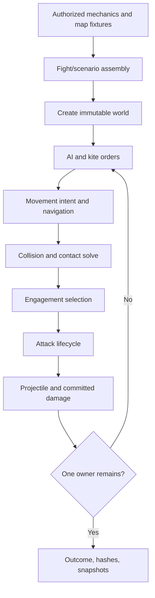

# Current clean-room JavaScript engine — 2026-08-15

This document describes the engine that is currently executed by
`src/combat/world.js`, the fight assembly in `src/fight.js`, and the dedicated
golden comparison in `src/dedicated-golden-comparison.js`. It is an
implementation guide, not a claim that every available unit or matchup is
fully calibrated.

The engine is a clean-room, deterministic, 60-tick-per-second simulation. It
does not load the production simulator. Unit mechanics come from generated
Genie `.dat` and reference-database fixtures; movement, targeting, and AI-order
rules are reconstructed from explicitly authorized golden recordings.

## Current evidence boundary

- The registry contains 14 units with generated mechanics fixtures.
- The dedicated ranged-versus-melee corpus contains 19 authorized archives,
  95 ratio rows, and 475 tape repeats.
- Every dedicated row has five tape repeats and preserves the exact recorded
  starting positions for that repeat.
- The newest current-engine check covers the two Hand Cannoneer families:
  10 rows and 50 exact-repeat simulations, all resolved, no wrong winners, no
  row above 25 points, and mean absolute row delta 3.67.
- The last full-portfolio report covers the earlier 17-archive engine. It is
  historical evidence because it predates the newest native-siege,
  minimum-range-retreat, exclusive-overlap, and Hand Cannoneer corpus changes.
  Do not present it as a current 19-archive run.

## Architecture



The important boundaries are:

- `src/fight.js`: validates selections, derives counts and placements, loads
  mechanics, normalizes asymmetric owner orientation, and constructs a world.
- `src/combat/world.js`: owns the per-tick state transition and terminal
  outcome.
- `src/combat/ai-orders.js`: implements the ordinary AI-player order sweep and
  the separate kiting beat controller.
- `src/combat/targeting.js` and `src/combat/attacks.js`: define distance,
  eligibility, timing, and damage rules.
- `src/combat/chase-path.js`, `local-avoidance.js`, `collision.js`, and the
  allied/crowd modules: turn movement intent into legal positions.
- `src/dedicated-golden-comparison.js`: builds exact-repeat scenarios and
  scores them against tape.
- `server.mjs` and `viewer/`: expose a local review UI. The server computes the
  battle first and the viewer replays returned snapshots; it is not a live
  streaming simulation.

## Deterministic tick lifecycle

One tick is 1/60 second. `stepWorld()` performs these operations in order:

1. Clone the prior immutable unit state into a mutable working set.
2. Invalidate dead pursuit and attack targets.
3. Decrement the first-acquisition timer and acquire eligible pursuit targets.
4. Issue kiting orders when a kite controller exists; otherwise issue the
   ordinary AI-player sweep/rescue orders.
5. Build movement proposals, route them, steer crowded groups, select any
   allowed allied-overlap pairs, and solve simultaneous collision constraints.
6. Update engagement targets from the post-movement contact and reach state.
7. Advance attack animations, release ready melee hits and ranged shots, and
   start newly eligible attacks.
8. Commit damage in deterministic order, resolve projectile flight, mark
   deaths, and clear target references to dead units.
9. Freeze and publish the new world, event list, and optional snapshot.

`runWorld()` stops when only one live owner remains. The maximum supported
fight is 9,000 ticks, or 150 seconds. Reaching that cap is recorded as an
unresolved timeout by the dedicated comparison; the engine does not currently
invent a winner or a knife-edge outcome from remaining HP.

## Unit state

Every unit carries:

- immutable identity, owner, position, facing, mechanics, unit master, and
  maximum mechanics provenance;
- current HP and alive/dead state;
- `pursuitTargetId`: where the unit is trying to go;
- `engagedTargetId`: the unit currently eligible to attack;
- `attackTargetId`: the target captured by an attack already in progress;
- `action`: idle, moving/reload, attacking, or dead;
- timers for initial acquisition, attack windup, reload, and full swing;
- optional move order, avoidance route, charge level, and diagnostic state.

Published worlds, units, events, and snapshots are frozen. Mutable `Map` and
`Set` objects are confined to controller state that deliberately persists
between ticks.

## Mechanics sources and unit coverage

`src/unit-registry.js` maps the supported unit slugs to generated fixtures in
`fixtures/unit_stats/`. Each fixture must carry its `.dat` hash, reference-DB
hash, and field-level provenance. A unit cannot be instantiated without this
provenance.

| Class | Units | Engine role |
|---|---|---|
| Mobile ranged | Arbalester, Hand Cannoneer, Heavy Cavalry Archer, Elite Skirmisher | May use the mechanics-derived cohesive kite controller |
| Siege ranged | Heavy Scorpion, Siege Onager | Uses native targeting/attack behavior; it is not assigned mobile-ranged group kiting |
| Melee | Champion, Paladin, Elite Steppe Lancer, Elite Battle Elephant, Elite Fire Lancer, Hussar, Heavy Camel, Halberdier | Pursues, surrounds, and attacks through the melee navigation stack |

Viewer availability is broader than dedicated golden coverage. A selectable
unit is not, by itself, proof that a golden tape exists for that pairing.

## Coordinate, body, and distance model

The Golden Arena physics map is 16 by 16 tiles. Gaia obstacles are retained
from the checked-in map fixture. Ordinary Gaia obstructions use a 0.5-tile
radius. The nine-object central grove is also sealed by a 1.5-tile core around
the source Panda Rock so a unit cannot enter an artificial seam and become
trapped inside the obstacle.

Different mechanics intentionally use different geometry:

- Movement speed is Euclidean and comes directly from
  `speed_tiles_per_second`, divided by 60 for one tick.
- Unit-versus-unit obstruction is an axis-aligned Genie box. Pair separation
  and melee contact use Chebyshev distance.
- Projectile reach is Euclidean over outline boxes.
- Melee attack reach is Chebyshev over outline boxes.
- Movement stopping uses collision boxes, while attack eligibility uses
  outline boxes. These are not interchangeable for cavalry, elephants, or
  Steppe Lancers.

The collision solver resolves map bounds, Gaia obstacles, and unit pairs
simultaneously. It uses numerical tolerances only for floating-point
convergence, allows up to 4,096 constraint sweeps, and has a recovery path that
restores invalid movement rather than terminating a dense fight.

## Target acquisition and pursuit

Initial reaction delay is a tape-measured engine property, not a unit stat.
The measured interval is 0.952–1.708 seconds. The deterministic simulator
assigns the expected order statistics of that interval across the roster,
ranked by reference ID. This preserves the measured stagger without random
jitter.

After the initial delay:

- a unit chooses the nearest live enemy within line of sight by surface gap;
- pursuit remains sticky while that target lives;
- an explicit AI order may replace the pursuit target immediately;
- a dead target invalidates pursuit and can be reacquired;
- kiting chasers sample their target location every 0.5 seconds, with a
  reference-ID phase offset, instead of perfectly tracking a moving target
  every tick;
- ordinary AI idle rescue can designate an enemy outside line of sight so
  separated survivors do not remain permanently blind.

The committed default is `engagement=pursuit`: a unit prioritizes its pursued
target once it has closed to the movement stop range. A blocked unit can still
fight another legally reachable enemy rather than idling beside it.

## Engagement envelope and attack start

The engine deliberately separates three concepts:

1. **Pursuit target** — the unit being chased.
2. **Movement stop range** — collision-box gap at most
   `max(attack_range, 0.1)`.
3. **Attack reach** — outline-box gap at most `attack_range + 0.1`.

The extra 0.1 tile is tape-measured melee contact tolerance. Ranged minimum
range is checked center-to-center before a target becomes attackable.

A new attack can begin only when reload is ready and the actor either reached
its stop range or did not move that tick. This allows a blocked back-line
range-1 melee unit to attack from its wider outline envelope without allowing
ordinary melee units to swing while running.

Kited scenarios have a configurable chase dwell. The engine fallback is 60
ticks, but the current viewer and dedicated golden scenarios explicitly set
it to zero: a chaser begins windup on the first legal range-entry tick.

## Attack lifecycle and damage

An ordinary attack runs as:

`swing start → attack delay → hit/projectile release → animation recovery → next swing`

- Attack delay is rounded to the nearest 60 Hz tick.
- Reload is rounded upward and runs from swing start to swing start.
- The actor remains in the attack action for the sourced animation duration.
- A released hit remains committed if the target later moves. An unreleased
  windup is canceled when its target dies or an overriding order changes it.
- A move-ordered kiter may start moving after release while the animation
  recovery continues; recovery still controls when it can retarget.
- Ready attacks are committed in stable order by ready tick, actor ID, target
  ID, and type.

Damage uses the unit's attack classes against the victim's matching armor
classes. Base melee class 4 and base pierce class 3 are handled by the same
rule, positive bonus classes stack, and every hit has a minimum of 1 damage.
Fractional damage is retained for splash and pass-through mechanics.

## Ranged projectiles

Ranged units create physical projectile records at the release frame.

- Projectile speed and half-width are sourced from the projectile mechanics.
- A normal projectile advances every tick and hits when its own width reaches
  the live target's collision box. It expires at its aim point if the target
  dies or moves away.
- `smart_mode` bit 1 enables a two-pass velocity lead for Ballistics. A target
  that changes direction after release can still evade.
- Accuracy below 100 uses a deterministic per-world PRNG. A miss scatters
  within the sourced dispersion radius and becomes a stray projectile that
  hits the first enemy body on its path for half damage, floored at 1.

The deterministic RNG is part of world state, so identical inputs produce
identical event and final-state hashes.

## Special attacks

### Heavy Scorpion

Heavy Scorpion is a native siege-ranged unit, not a cohesive mobile kiter.

- It has a sourced 2-tile minimum range.
- If an enemy is inside minimum range and the Scorpion is not attacking, it
  retreats directly away at its sourced speed.
- Local avoidance preserves the `minimum-range-retreat` intent and searches
  deterministic side headings when another unit blocks the direct retreat.
- Its bolt has physical width, passes through enemies, deals full per-victim
  class damage to the action target, and half per-victim class damage to every
  other crossed enemy.
- The bolt continues 3 tiles past its aim point and cannot damage the same
  victim twice.

### Siege Onager

- The primary shell flies to its aim point and then explodes.
- Units from either owner can take damage; the actor is excluded.
- A victim containing the impact point takes full class damage. Otherwise
  damage tapers linearly by center distance to the sourced blast radius and is
  floored at 1.
- Visual secondary projectiles scatter over the sourced spawning area and
  deal the floor 1 damage when their landing point lies inside a unit box.

### Elite Battle Elephant

- The primary target takes ordinary post-armor damage.
- Trample is centered on the attacker at the hit frame.
- Every other enemy whose collision box intersects the sourced blast width
  takes the sourced fraction of its own post-armor damage.
- Allies and the primary target do not receive an extra trample hit.

### Elite Fire Lancer

- Units spawn with full type-6 charge.
- The opening charge volley holds the unit in place and releases the sourced
  projectile count on the sourced special-animation frame.
- Charge-projectile armor-class matching ignores the numeric armor value, as
  measured on tape.
- The ordinary reload begins at charge swing start. Charge recovery and
  reacquisition use the same state machine as other attacks.

## Ordinary AI-player orders

With `orders=1`, non-kiting fights use the tape-derived AI order layer:

- opening sweep begins at 2.72 seconds;
- one order is issued per side roughly every 0.2 seconds during the sweep;
- recipients are considered in descending reference-ID order;
- 2–4 nearby, unengaged units can share one designation;
- sweep targets are distinct enemies in ascending reference-ID order;
- after the sweep, a unit idle for 1 second can receive a rescue order;
- rescue orders are rate-limited to one per side every 1.2 seconds.

An order immediately replaces pursuit, clears conflicting engagement, and
cancels an unreleased attack against a different target.

## Kiting controller

Mobile-ranged kiting uses a group shoot-and-scoot controller, separate from
ordinary AI-player sweeps.

### Mechanics-derived clock

The recurring beat is derived from sourced reload and attack delay:

- the command grid is 40 ticks;
- reload is rounded up to the next 40-tick grid point for the attack beat;
- movement lanes recur every 80 ticks;
- release delay determines the first movement offset after a beat.

Policy rows retain only behavior that stats cannot answer. Current special
policies are the HCA opening/top-up phase and Hand Cannoneer opening volley,
translated-offset formation motion, and close-to-fire behavior. Generated
`src/kite-profiles.js` remains a regression oracle, not the source of the
recurring clock.

### Attack beat

- carried targets from the previous beat are considered first;
- fresh targets are ordered by distance from the kiter centroid;
- shooters outside legal firing reach are not assigned;
- a target receives `floor(HP / per-shot damage) + 1` shooters;
- when a large roster cannot kill the first target, roughly 75% pressure the
  first target and the remainder spill to another;
- unused reachable shooters pile onto the last designated target.

### Movement beat and cohesive formation

- The route follows a square ring around the arena center.
- Direction is chosen once, away from the enemy centroid.
- Waypoints sit on a 1.5-tile perimeter lattice with a 4-tile lead.
- Ordinary ranged units reform into stable compact slots around the shared
  waypoint.
- Hand Cannoneers translate their current offsets as a group instead of
  rebuilding a new absolute grid every beat.
- The cohesive navigator holds the original spawn until the first real move
  order, forms at that order, inflates obstacle clearance for the whole body,
  retains stable slots, and replans after sustained stalls.

The enemy-free movement lab uses the same order clock and formation movement
for exactly 21 ranged units, but skips attacks and melee designation.

## Attack-move behavior for kiting tests

The current viewer and dedicated mobile-ranged scenarios issue one melee-side
attack-move at tick 36 (0.6 seconds):

- every melee unit begins toward the current ranged-group centroid;
- acquisition is armed immediately;
- as soon as a visible target is found, pursuit interrupts the location move;
- a unit with no visible target continues toward the approach waypoint and
  scans again every tick;
- a blocked attack-mover may reevaluate its target;
- chase capture can transfer pursuit to a front-line ranged body physically
  contacted during the chase.

This is different from first walking all the way to an old centroid and only
then looking for a target.

## Pathfinding and local avoidance

Three layers cooperate:

1. **Grid chase planner** — 0.25-tile A* cells, octile cost, 2-tile waypoint
   lookahead, and an 8,192-expansion ceiling. It routes chasers around bodies
   and map obstacles on the 0.5-second repath cadence.
2. **Persistent local avoidance** — constructs tangent routes around the
   blocking body, checks bounds and other constraints, and preserves route
   state instead of returning immediately to a blocked direct line.
3. **Full-speed steering/bimodal solve** — a blocked kiting chaser searches
   headings in 15-degree increments, up to 90 degrees each side. It takes a
   full sourced-speed step or stops; it does not grind forward at an artificial
   partial speed.

Kiter obstacle routing plans around enemy bodies while normal allied
compression remains the collision solver's responsibility. Treating every
ally as a hard A* wall would tear the formation apart.

## Allied overlap, wedges, and congestion prevention

Friendly collision uses the sourced
`min_collision_size_multiplier` while a unit is moving. Enemy collision never
shrinks.

The current melee crowd policy adds two independent controls:

- **Preventive contact-graph steering** projects a movement horizon and rotates
  risky proposals before they create a compact connected cluster. The default
  steering strength is 0.5.
- **Exclusive allied overlap reservations** allow movement-driven friendly
  shrink only for selected pairs. Each unit can belong to at most one deep
  pair. A third unit sees both reserved partners at full allied extent, which
  prevents an entire cohort collapsing into one compact stack.

Reach melee has an additional, explicit transit mode. A melee chaser with
sourced attack range of at least 1 tile may reserve one front-line ally while
entering its legal engagement envelope, forming a two-deep wedge. The rule is
stat-based and currently applies to Elite Steppe Lancer; it does not shrink
the unit's collision box, admit a third partner, or affect range-0 melee.

These policies are scenario controls rather than global assumptions. The
current dedicated and kiting-viewer scenarios enable preventive crowd steering
for the melee owner. Mobile-ranged scenarios may additionally enable the
range-1 wedge rule. Native siege scenarios do not create a kite state but still
use melee crowd steering and exclusive overlap control.

## Placement and owner normalization

Free-form fights resolve one of four placement families: ranged-versus-ranged,
kite, siege, or waves. The role-asymmetric kite and siege families are always
run internally with the ranged/siege role as owner 2, matching recorded
geometry, then relabeled in the response if the user selected the opposite UI
order. This makes swapping dropdown order presentation-only.

Dedicated comparisons do not use generated placement. Each tape repeat is
constructed from its own `starting_units` records, preserving reference ID,
owner, master, and exact `x/y` coordinates.

## Fight selection and counts

`runFight()` accepts either:

- explicit `n2` and `n3`, both required together; or
- an equal-resource budget, using sourced base costs and placement capacity.

The viewer caps each side at 21 units for the normal battle page. Synthetic
playback tooling has its own higher review-only cap. Dedicated comparisons use
only tape ratios and never derive counts from budget.

## Output and determinism

The engine records the complete internal event log. Viewer payloads omit noisy
`move` and `blocked` events but retain combat and order events. Each result
contains:

- terminal tick, winner owner, and winner HP;
- a stable unit index for rendering;
- slim per-tick snapshots when requested;
- a canonical final-state SHA-256;
- a canonical full-event-log SHA-256.

Identical inputs and configuration must reproduce both hashes. Dedicated
workers run without snapshots to reduce memory while preserving the full event
log and hashes.

## Committed defaults and experiment flags

`src/engine-config.js` commits these defaults:

| Setting | Default | Meaning |
|---|---|---|
| `engagement` | `pursuit` | Prefer the pursued target once properly closed |
| `orders` | enabled | Run the AI-player order layer outside kite worlds |
| `step` | `chaser` | Apply full-speed-or-stop steering to kited chasers |
| `chasePath` | `grid` | Use obstacle-aware A* pursuit |
| `pursuit`, `avoid`, `minRange`, `kiteEngage` | empty | Experimental alternatives remain off |

`AOE2X_EXP_*` variables can override these values for controlled experiments.
Reports must record non-default settings. The ordinary viewer and dedicated
comparison use committed defaults plus their explicit scenario controls.

## What is sourced, measured, or policy

### Sourced from mechanics fixtures

HP, speed, collision and outline sizes, line of sight, attack range, minimum
range, reload, attack delay, animation length, projectile speed/width,
accuracy, dispersion, smart mode, armor and attack classes, allied minimum
collision multiplier, blast fields, charge fields, and base resource costs.

### Measured from authorized tapes

Initial acquisition interval, 0.1-tile melee contact tolerance, AI sweep and
rescue timing, kiting command grid and order patterns, chaser repath cadence,
formation/ring behavior, allied shrink plateaus, full-speed-or-stop movement,
pass-through bolt fraction/overshoot, and special-attack interpretation.

### Deterministic policy where the recording does not reveal the random draw

Reference-ID assignment of acquisition ranks, deterministic tie breaks,
deterministic projectile PRNG seed, left/right parity for symmetric retreat
steering, and stable ordering of simultaneous events.

These policy choices must remain general. They may not name a particular
matchup merely to force its score toward tape.

## Known limitations

- The engine reproduces observable tape behavior, not the original proprietary
  AoE2 source code.
- Accuracy and charge scatter are deterministic approximations of stochastic
  game behavior.
- The viewer precomputes and replays; it does not stream a live world.
- The 9,000-tick cap reports unresolved instead of inferring a winner.
- Not every registry pairing has a dedicated golden archive.
- A full current 19-matchup rerun is still required before claiming a current
  portfolio-wide score after the newest collision and siege changes.
- Formation policy and AI-order reconstruction remain the most abstract layer;
  unit stats alone cannot derive player-issued target assignment.

## Verification entry points

```powershell
npm test

node tools/run_recoverable_dedicated_rows.mjs `
  --output-dir calibration/reports/<run-name> `
  --matchup-ids hand_cannoneer_vs_champion,hand_cannoneer_vs_paladin
```

See [Golden tape comparison workflow](GOLDEN_TAPE_COMPARISON_WORKFLOW.md) for
archive intake, exact-repeat import, recoverable execution, and scoring.
