# AoE2 Sprite Catalog

This catalog lists all downloaded sprites for verification. Check that each sprite matches its intended unit/building type.

## Unit Sprites (38 total)

| Name | File | Preview |
|------|------|---------|
| arbalester | units/arbalester.png | 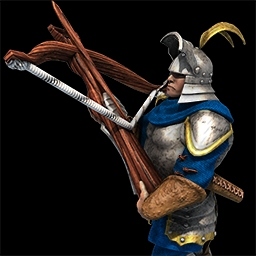 |
| archer | units/archer.png | 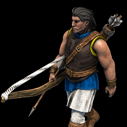 |
| batteringram | units/batteringram.png | 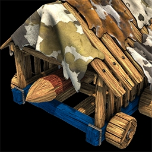 |
| bombardcannon | units/bombardcannon.png | 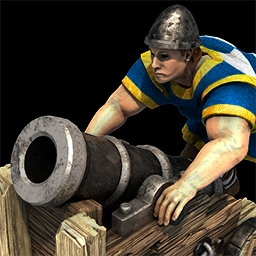 |
| cappedram | units/cappedram.jpg | 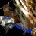 |
| cavalier | units/cavalier.png | 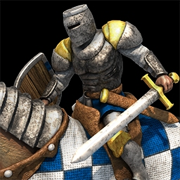 |
| cavalryarcher | units/cavalryarcher.png | 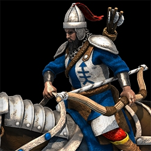 |
| champion | units/champion.png | 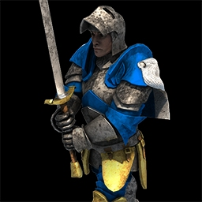 |
| crossbowman | units/crossbowman.png | 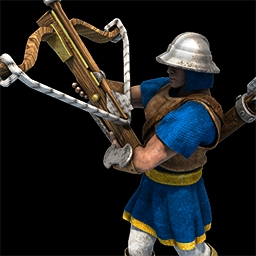 |
| fireship | units/fireship.jpg | 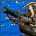 |
| fishingship | units/fishingship.jpg | 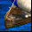 |
| galleon | units/galleon.png | 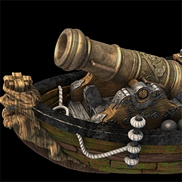 |
| galley | units/galley.png | 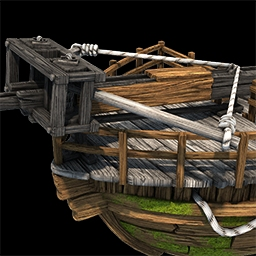 |
| halberdier | units/halberdier.png | 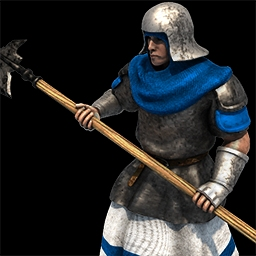 |
| heavyscorpion | units/heavyscorpion.jpg |  |
| hussar | units/hussar.png | 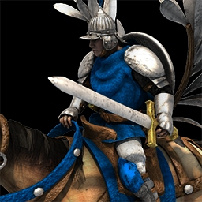 |
| knight | units/knight.png | 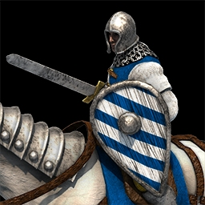 |
| lightcavalry | units/lightcavalry.png | 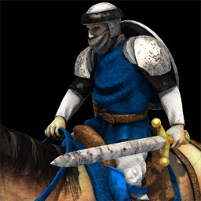 |
| longswordsman | units/longswordsman.png | 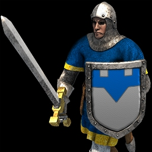 |
| manatarms | units/manatarms.png | 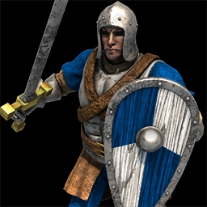 |
| mangonel | units/mangonel.png | 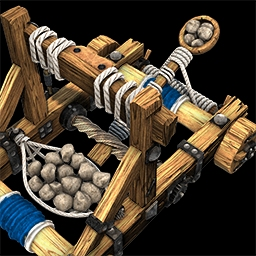 |
| militia | units/militia.png | 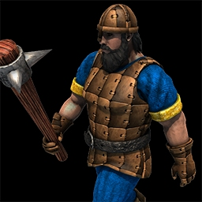 |
| monk | units/monk.png | 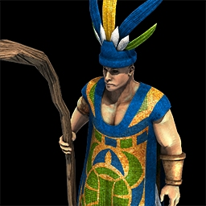 |
| onager | units/onager.png |  |
| paladin | units/paladin.png | 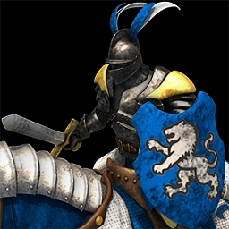 |
| petard | units/petard.png | 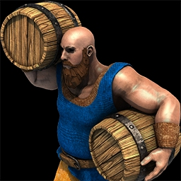 |
| pikeman | units/pikeman.png | 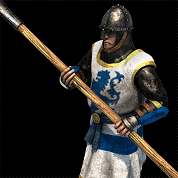 |
| scorpion | units/scorpion.jpg | 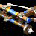 |
| scoutcavalry | units/scoutcavalry.png | 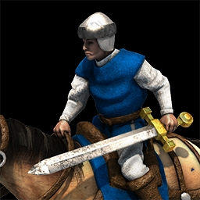 |
| siegeonager | units/siegeonager.png | 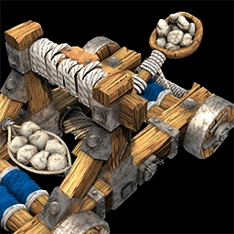 |
| siegeram | units/siegeram.jpg | 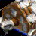 |
| skirmisher | units/skirmisher.png | 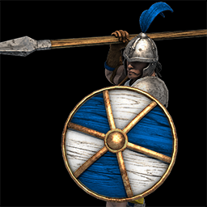 |
| spearman | units/spearman.png | 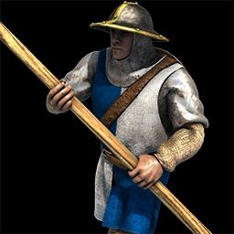 |
| tradecog | units/tradecog.jpg | 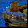 |
| transportship | units/transportship.png | 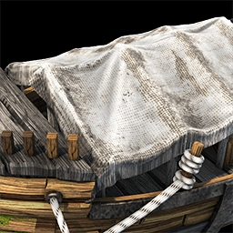 |
| trebuchet | units/trebuchet.png | 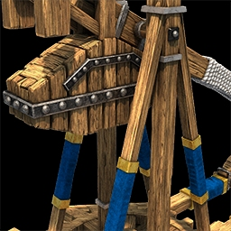 |
| villager | units/villager.png | 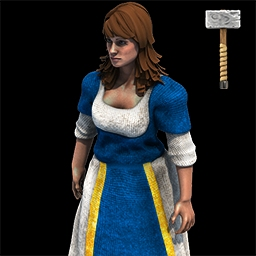 |
| wargalley | units/wargalley.png |  |

## Building Sprites (17 total)

| Name | File | Preview |
|------|------|---------|
| archeryrange | buildings/archeryrange.png | 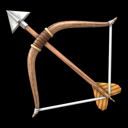 |
| barracks | buildings/barracks.png | 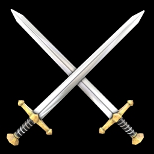 |
| blacksmith | buildings/blacksmith.png | 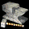 |
| bombardtower | buildings/bombardtower.png | 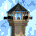 |
| castle | buildings/castle.png | 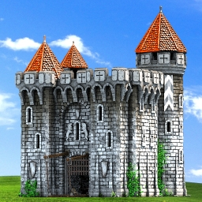 |
| farm | buildings/farm.png | 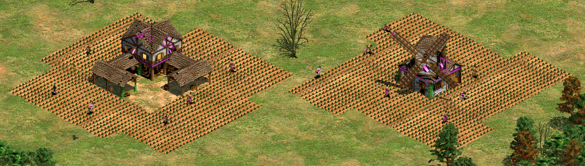 |
| house | buildings/house.png | 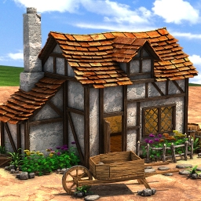 |
| lumbercamp | buildings/lumbercamp.png | 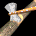 |
| market | buildings/market.png | 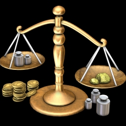 |
| mill | buildings/mill.png |  |
| miningcamp | buildings/miningcamp.png | 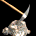 |
| monastery | buildings/monastery.png | 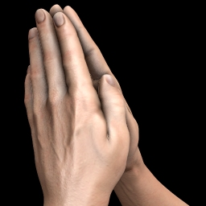 |
| siegeworkshop | buildings/siegeworkshop.png | 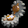 |
| stable | buildings/stable.png | 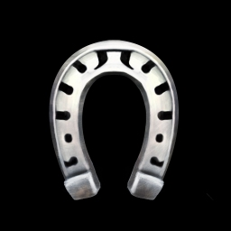 |
| towncenter | buildings/towncenter.png | 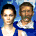 |
| university | buildings/university.png | 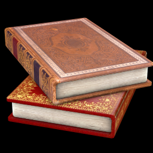 |
| watchtower | buildings/watchtower.png |  |

## Missing Sprites

### Units not found:
- twohandedswordsman
- demolitionship  
- king

### Buildings not found:
- dock
- guardtower
- keep

## Type Mapping

These sprites will be matched to unit/building types detected in replays:

### Unit Category Fallbacks
If an exact sprite isn't found, fall back to category:
- Infantry (militia, manatarms, longswordsman, champion, spearman, pikeman, halberdier) -> Use closest match
- Archers (archer, crossbowman, arbalester, skirmisher, cavalryarcher) -> Use closest match
- Cavalry (scoutcavalry, lightcavalry, hussar, knight, cavalier, paladin) -> Use closest match
- Siege (batteringram, mangonel, scorpion, trebuchet, bombardcannon) -> Use closest match
- Ships (galley, fireship, transportship, tradecog) -> Use closest match
- Monks -> monk sprite
- Villagers -> villager sprite

### Building Fallbacks
- Production buildings -> Use category building
- Resource buildings (mill, lumbercamp, miningcamp) -> Use specific or small building shape
- Defense buildings (towers, walls) -> Use closest match

## Source

Sprites downloaded from: https://github.com/qwyt/aoe2-icon-resources
(Originally scraped from Age of Empires Fandom wiki)
